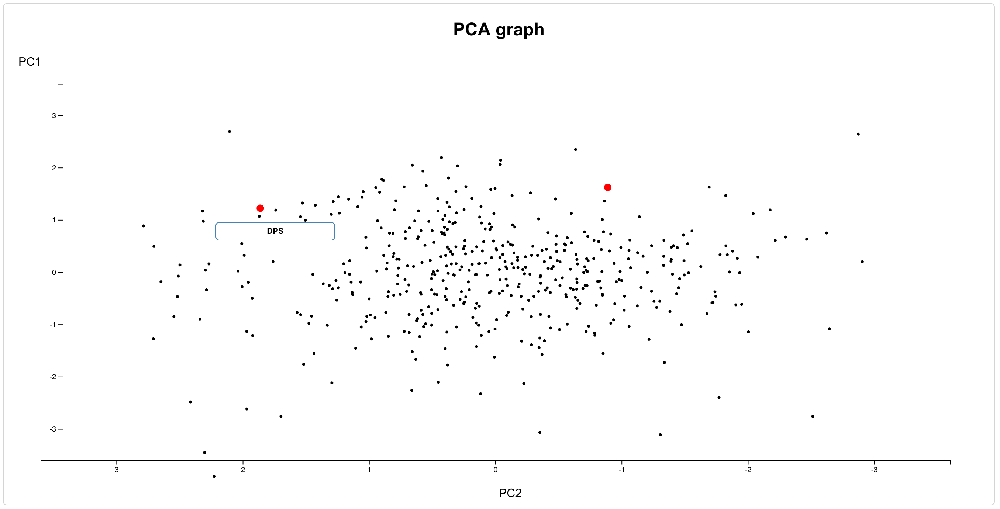

# Modern Portfolio Theory

Choosing the correct investment portfolio to have is a really difficult task, this is the first and most difficult thing to define, because once that it is set, the investors task is basically to follow it. There are different ways and analysis to make in order to define a portfolio allocation, one of them is known as Modern Portfolio Theory (MPT), and this is the one that is implemented in this website.

This website constitutes of four main parts, the first presents the Principal Component Analysis (PCA), the second shows the risk return graph for the assets chosen, the third show the evolution of both assets separately and in the portfolio composition and lastly the portfolio evolution using the Dollar Cost Averaging (DCA) method.

This project was developed using 3d.js, which is a JavaScript library to create graphs.

The source code of this project can be found on [GitHub](https://github.com/ibiscp/Modern-Portfolio-Theory).

 

